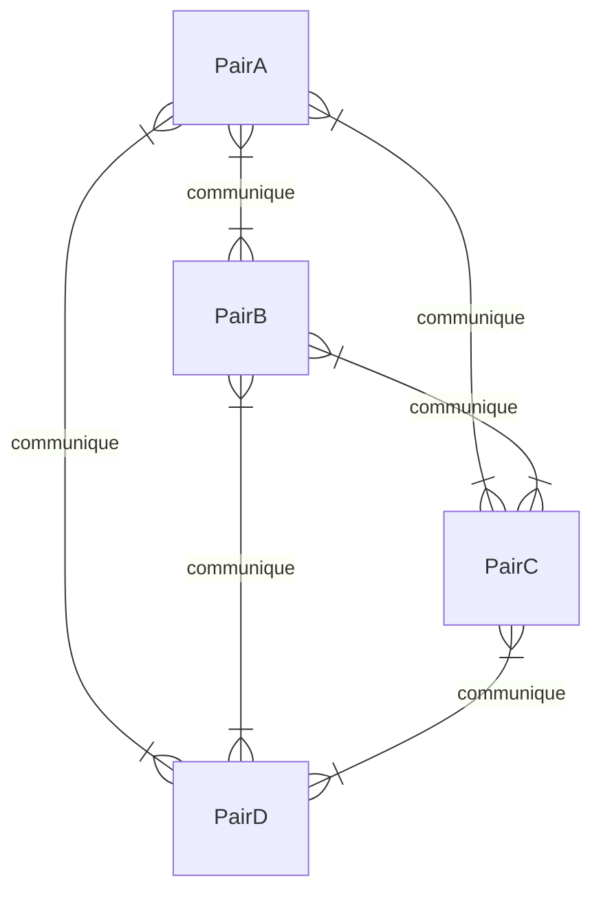
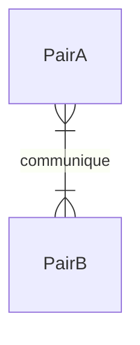
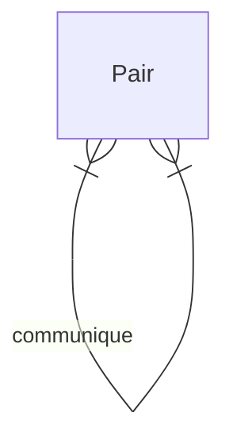

# Implémenter une connexion peer to peer entre deux processus avec le protocole TCP

Schéma dégueu d'un reseau en mailles peer to peer.

## Synopsis
L'objectif de ce projet est de concevoir un protocole peer to peer de la couche application à partir du protocole TCP. 

Le 2nd objectif est personnel. Cet exercice me permettra de comprendre mieux les tenants et aboutissants des connexions peer to peer. L'élan originel qui m'a poussé à la conception de ce projet est l'api WebRTC que je souhaitais comprendre plus facilement.

J'ai donc interrompu mon apprentissage de l'api web RTC pour me lancer dans la conception d'un protocole peer to peer à partir du protocole TCP.

Pour stimuler ma réflexion, j'ai décidé de ne pas regarder le fonctionnement des autres protocoles peer to peer. 

Ayant majoritairement fait du développement web, je suis très peu confronté à des architectures autres que l'architecture client serveur. 

Une fois mon protocole implémenté pour la communication entre 2 processus et la communication entre plusieurs processus dans un réseau en émail.

Je m'intéresserai au protocole existant de la couche application. :) (A partir du livre Réseau de Andrew Tanenbaum) 

## Cahier des charges

J'ai conçu 2 cahiers des charges différents : 
- un cahier des charges qui a orienté implémentation et qui se concentre sur les limites des sockets TCP et comment utiliser ces sockets pour effectuer des communications en pair à pair.
- Un autre cahier des charges qui se concentre sur les fonctionnalités qu'un père doit posséder sans prendre en compte l'implémentation, les limites du protocole TCP. 

### Version A - Pensez à l'implémentation en premier. 

Ceci est la première version du cahier des charges. Je l'ai conçu en premier en pensant à l'implémentation du protocole. 

Il part donc de certains présupposés qu'ils ne seront pas forcément nécessaires si on se concentre sur la théorie qui est écrite dans le cahier des charges de la version B. 

Par exemple, il précise l'état dans lequel les sockets TCP des paires doivent se trouver pour établir une connexion. Il part également du principe qu'un socket unique est fourni par notre encaplusation.

Ce socket(file descriptor Linux) peut provenir de 2 endroits différents :
- soit de la fonction `accept()` qui retourne le socket du pair qui a été accepté.
- Soit de la fonction `socket()` si le socket etait dans l'etat connect puis à été accepté par un autre pair. 

On peut ensuite lire ou écrire sur ce socket pour communiquer en duplex. 

|Tache|Description|
|-|-|
|Tout les pairs sont identiques| La différence de l'architecture client serveur tous les pairs ont les mêmes capacités, ceci pour décentraliser le réseau |
| Connexion à un pair | Chaque paire possède 2 soquettes lysen et Connect.  -Un pair peut se connecter au accepte d'un autre.   - Un pair peut accepter le connecte d'un autre |
| Envoi de donnée | Pour envoyer des données, il faut écrire dans le socket pair_fd   Dans tous les cas, un seul pair_fd actif peut exister dans une connexion entre 2 paires.   |
| Reception de donnée | Pour recevoir des données, il faut lire le socket pair_fd. |
| Le pairStream | Un objet qui permet de d'emettre ou recevoir des données|

#### Pensez la communcation en processus identiques

Je pense qu'il est inutile de penser les communications pair à pair comme une communications entre 2 processus.

Etant donné que tous les pairs sont parfaitement identiques, il doit être possible, je pense, qu'un pair puisse communiquer avec lui même. 

Je trouve donc plus simple de m'imaginer les communications entre les pairs comme ceci.

> D'autant plus qu'il possédera probablement 2 sockets différents (car un socket TCP qui est dans l'etat *listen* ne peut être dans l'etat *connect*).

### Version B - Pensez aux fonctionnalités en premier.

Pour cette 2e version du cahier des charges, j'ai souhaité me détacher de l'implémentation pour simplifier ma réflexion lors de la conception de ce protocole. 

J'ai basé ma réflexion sur les communications humaines qui sont en soit très similaires aux communications pair à pair sur un réseau décentralisé.

Un humain possède des oreilles et une bouche :
- Il peut parler à n'importe quel humain qu'il croise, ce qui provoque une connexion avec cet autre humain. 
- Il possède égalements des oreilles pour entendre à la volée n'importe quelle connexion d'un autre humain. Une fois qu'un humain a entendu ce qu'un autre humain à lui dire, il sont ainsi connecté. 

C'est l'analogie à partir de laquelle je suis parti pour la conception de ce cahier des charges.

Cela pourrait me permettra de concevoir des tests avant de coder et donc de ne pas être trop limiter par l'implémentation. 

En effet, le protocole TCP que j'ai choisi d'utiliser m'handicap pas mal à cause de certaines fonctionnalités, comme le fait qu'un socket `listen` soit dans l'incapacité de se connecter à un autre socket. 

> Il me faudra d'ailleurs probablements deux sockets pour chaque process.

J'ai peur qu'une fois le protocole implémenté, il s'en retrouve fortement complé au fonctionnement du protocole TCP et donc très peu modifiable pour l'usage d'un autre protocole à l'avenir.

Un protocole se doit d'être définie sans prendre en compte l'implementation des protocoles de couches inférieures ou supérieures.

|Tache|Description|
|-|-|
|Tout les pairs sont identiques| A la différence de l'architecture client serveur tous les pairs ont les mêmes capacités, ceci pour décentraliser le réseau |
| Envoi de donnée |Un pair peut envoyer des données à un autre pair.  - L'envoi d'une donnée provoque une connexion si elle n'a pas déjà été établie.  - Un pair qui envoie des données n'a pas nécessairement besoin de fournir,à chaque envoi, les informations de connexion au pair qui recoit.   - Le fait de préciser les informations de connexion sur un pair auquel vous êtes déjà connecté ne doit pas provoquer une 2nde connexion. |
| Reception de donnée | Un pair peut recevoir des données de n'importe quel pair, ce qui provoque alors la connexion vers ce pair là.|
| Le pairStream | Un objet qui permet de d'emettre ou recevoir des données|

